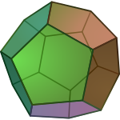

# Germany National 2016

## Vòng 1

### Bài 1

Cho số được viết với $2016$ chữ số $0$: $101010\dots 0101$ mà các số $1$ và $0$ được viết xen kẽ. Chứng minh rằng số đó không phải là số nguyên tố.

### Bài 2

Cho tam giác $ABC$ với diện tích bằng $1$. An và Bình chơi một trò chơi như sau: An chọn một điểm $X$ trên cạnh $BC$, Bình chọn một điểm $Y$ trên cạnh $CA$ và sau đó An chọn một điểm $Z$ trên cạnh $AB$; ba điểm được chọn không được trùng với đỉnh của tam giác. An phải cố gắng làm sao cho diện tích của tam giác $XYZ$ là lớn nhất có thể, Bình thì muốn điều ngược lại sao cho diện tích tam giác $XYZ$ là bé nhất có thể.

Nếu hai người chơi bằng chiến thuật tốt nhất thì diện tích của tam giác $XYZ$ cuối cùng là bao nhiêu?

### Bài 3

Bốn điểm $A,B,C,D$ theo thứ tự nằm trên một đường tròn. Hai đoạn $AC$ và $BD$ cắt nhau tại $P$. Đường vuông góc với $AC$ tại $C$ và đường vuông góc với $BD$ tại $D$ cắt nhau tại $Q$.

Chứng minh rằng hai đường thẳng $AB$ và $PQ$ vuông góc với nhau.

### Bài 4

Trong một lớp có $33$ học sinh. Mỗi học sinh viết lên bảng số lượng các bạn còn lại có tên họ giống học sinh đó (không tính bản thân học sinh đó). Sau đó mỗi học sinh lại viết lên bảng số lượng các bạn còn lại có tên gọi giống học sinh đó (không tính bản thân mình). Cuối cùng trong $66$ số được viết lên bảng thì các số $0,1,2,\dots,10$ mỗi số đều được viết ít nhất một lần lên bảng.

Chứng minh rằng trong lớp có ít nhất hai bạn cùng chung tên họ và tên gọi.

## Vòng 2

### Bài 1

Với $n$ số ta có thể tạo nên $\frac{n\left( n - 1\right)}{2}$ cặp hai số với nhau. Hỏi với $n\geq 3$ nào thì tồn tại $n$ số nguyên mà các cặp đó có tổng tạo thành một dãy số liên tiếp?

### Bài 2

Chứng minh rằng có vô số các số nguyên dương mà không thể được viết dưới dạng $\frac{n\left( n + 1 \right)}{2} + p$, trong đó $n$ là số nguyên dương và $p$ là một số nguyên tố.

### Bài 3

Tìm tất cả các hàm số $f$ được định nghĩa với tất cả các số thực khác $\frac{1}{3}$ và $-\frac{1}{3}$ thoả mãn:

$$
f\left( \frac{x + 1}{1 - 3x} \right) + f\left( x \right) = x
$$

### Bài 4

Mỗi mặt của một hình khối đều $12$ mặt nằm trên một mặt phẳng cố định. Các mặt phẳng này chia không gian thành hữu hạn phần không giao nhau. Hỏi có bao nhiêu phần tất cả?

